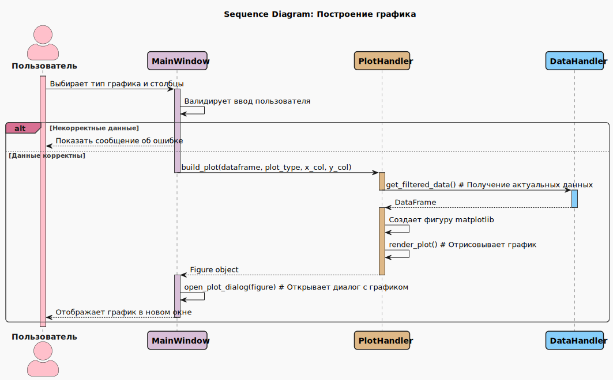

# 💼 Спецификация проекта (Technical Specification)

Добро пожаловать в техническую спецификацию проекта **client-data-analysing-tool**! Этот документ описывает архитектурные решения, ключевые компоненты, модель данных и другие технические аспекты десктопного приложения для анализа данных.

| Параметр | Описание |
| -------- | -------- |
| **Продукт** | Десктопное приложение для анализа и визуализации клиентских данных из CSV-файлов |
| **Кодовое имя** | client-data-analysing-tool |
| **Методология** | Agile Scrum |
| **Инструменты** | GitHub, Qt Designer |
| **Технологии (Стек)** | Python, PyQt6, pandas, matplotlib, reportlab, SQLite |
| **Аутентификация** | Не требуется (однопользовательское локальное приложение) |
| **Деплой** | Исполняемый файл или исходный код с виртуальным окружением |
| **UI‑палитра** | #2f4156 #567c8d #c8d9e6 #f5efeb #ffffff |

---

## 1. Функциональные требования (FR)

| Модуль | Функциональность | Приоритет |
|--------|------------------|-----------|
| **Управление файлами** | Загрузка данных из CSV (разделитель `;`, кодировка `UTF-8`), автоматическое открытие последнего файла | MUST HAVE |
| **Просмотр данных** | Отображение данных в таблице с прокруткой, открытие таблицы в отдельном окне | MUST HAVE |
| **Манипуляция данными** | Сортировка по столбцам (возрастание/убывание), фильтрация по значению | MUST HAVE |
| **Визуализация** | Построение 5 типов графиков (Гистограмма, Scatter, Линейный, Столбчатый, Круговой) | MUST HAVE |
| **Отчетность** | Генерация PDF-отчета с текущим представлением данных | MUST HAVE |
| **Сохранение состояния** | Автоматическое сохранение состояния (файл, фильтры) в SQLite между сеансами | MUST HAVE |

---

## 2. Нефункциональные требования (NFR)

| Аспект | Требование |
|--------|------------|
| **Производительность** | Время загрузки и отображения CSV-файла объемом 100 МБ ≤ 10 сек |
| **Надежность** | Частота критических сбоев (крах приложения) < 1% |
| **Юзабилити** | Интерфейс интуитивно понятен пользователю, знакомому с Excel |
| **Совместимость** | Кроссплатформенность (Windows, Linux, macOS) |
| **Локализация** | Поддержка кириллицы (UTF-8) в данных и интерфейсе |

---

## 3. Архитектура решения

**GUI (PyQt6):**

- Основное окно (`QMainWindow`)
- Таблица данных (`QTableView` с кастомной моделью на основе `pandas`)
- Диалоговые окна для графиков (`QDialog` с `FigureCanvas` от `matplotlib`)
- Стилизация через CSS-подобные таблицы стилей Qt

**Бизнес-логика (Python):**

- Обработка данных: `pandas` (загрузка, фильтрация, сортировка, вычисление метрик)
- Визуализация: `matplotlib` (построение графиков)
- Работа с отчетами: `reportlab` (генерация PDF)
- Локальное хранилище: `SQLite` (кеш данных, состояние приложения)

**Взаимодействие:**

- MVC-подобный паттерн: Модель (`pandas.DataFrame`) - Представление (`QTableView`) - Контроллер (обработчики событий PyQt)

---

## 4. Модель данных

### Описание структур

**CSV-файл:**

- Первая строка содержит заголовки столбцов
- Разделитель - точка с запятой (`;`)
- Кодировка - `UTF-8`
- Данные: строки, числа, даты (определяются автоматически)

**DataFrame (pandas):**

- Основная структура данных в памяти
- Загружается из CSV-файла
- Используется для фильтрации, сортировки, вычислений

**База данных SQLite:**

- Таблица `app_state`: хранение пути к последнему файлу, примененных фильтров
- Таблица `data_cache`: опциональное кеширование загруженных данных для ускорения повторной загрузки

### Ключевые атрибуты данных

Программа не предъявляет жестких требований к структуре CSV-файла. Анализ и построение графиков возможны для любых столбцов, содержащих числовые или категориальные данные.

---

## 5. Модули приложения

**Основные модули:**

- `main.py`: Точка входа, инициализация приложения
- `main_window.py`: Главное окно, управление интерфейсом
- `pandas_model.py`: Адаптер pandas.DataFrame для QTableView
- `data_handler.py`: Загрузка, сохранение, фильтрация, сортировка данных
- `plot_handler.py`: Построение и отображение графиков
- `report_handler.py`: Генерация PDF-отчетов

**Взаимодействие модулей (Сценарий: Построение графика):**
Для наглядности ключевого сценария использования ниже представлена диаграмма последовательности, иллюстрирующая процесс построения графика.

*Рисунок 1: Диаграмма последовательности, иллюстрирующая процесс построения графика по данным, выбранным пользователем.*

---

## 6. UX/UI принципы

| Принцип | Реализация |
|---------|------------|
| **Интуитивность** | Интерфейс аналогичен знакомым инструментам (Excel, проводник) |
| **Обратная связь** | Визуальные подсказки: курсор загрузки, сообщения об ошибках, предупреждения о некорректных данных для графиков |
| **Адаптивность** | Минимальное разрешение экрана: 1280x720. Интерфейс адаптируется к размеру окна. |
| **Доступность** | Поддержка навигации с клавиатуры (Tab, Enter), читаемые шрифты, контрастные цвета |

---

## 7. Бэклог

### [EPIC-01] Базовая функциональность

- [US-1.1] Загрузка и отображение CSV-файла
- [US-1.2] Просмотр данных в таблице с прокруткой
- [US-1.3] Автоматическое открытие последнего файла

### [EPIC-02] Манипуляция данными

- [US-2.1] Сортировка данных по столбцам
- [US-2.2] Фильтрация данных по значению

### [EPIC-03] Визуализация

- [US-3.1] Построение гистограммы и круговой диаграммы
- [US-3.2] Построение диаграммы рассеяния и линейного графика
- [US-3.3] Построение столбчатой диаграммы

### [EPIC-04] Отчетность и сохранение

- [US-4.1] Генерация PDF-отчета
- [US-4.2] Сохранение состояния приложения в SQLite

### [EPIC-05] Пользовательский опыт

- [US-5.1] Открытие таблицы в отдельном окне
- [US-5.2] Обработка ошибок (некорректный файл, данные для графиков)

---

## 8. Тестирование

- **Модульное тестирование:** Критические функции обработки данных (`data_handler.py`)
- **Интеграционное тестирование:** Сценарии "Загрузка файла -> Сортировка -> Построение графика"
- **Приемочное тестирование:** Проверка соответствия Критериям Приемки (AC) из User Stories

---

## 9. Деплой и поставка

- **Локальная разработка:** Виртуальное окружение (`.venv`) с установкой зависимостей из `requirements.txt`
- **Сборка:** Возможность создания исполняемого файла (`pyinstaller`, `cx_Freeze`) для различных ОС
- **Поставка:** Релизы на GitHub в виде архива с исходным кодом и инструкцией по установке, либо готового исполняемого файла.

---

## 10. Критерии приёмки MVP

| Функциональность | Критерий завершения |
|------------------|---------------------|
| **Управление файлами** | Пользователь может загрузить CSV-файл и увидеть его содержимое в таблице. При повторном запуске приложения последний файл открывается автоматически. |
| **Манипуляция данными** | Пользователь может отсортировать данные по любому столбцу и отфильтровать их по значению. |
| **Визуализация** | Пользователь может построить все 5 типов графиков, выбрав соответствующие столбцы с данными. |
| **Отчетность** | Пользователь может сгенерировать PDF-файл, содержащий текущее состояние таблицы. |
| **Надежность** | Приложение не завершает работу аварийно при обработке корректных CSV-файлов и выводит понятные сообщения об ошибках в случае проблем. |

---
